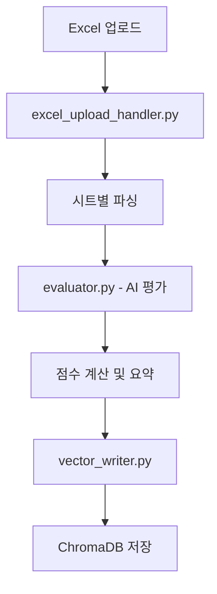
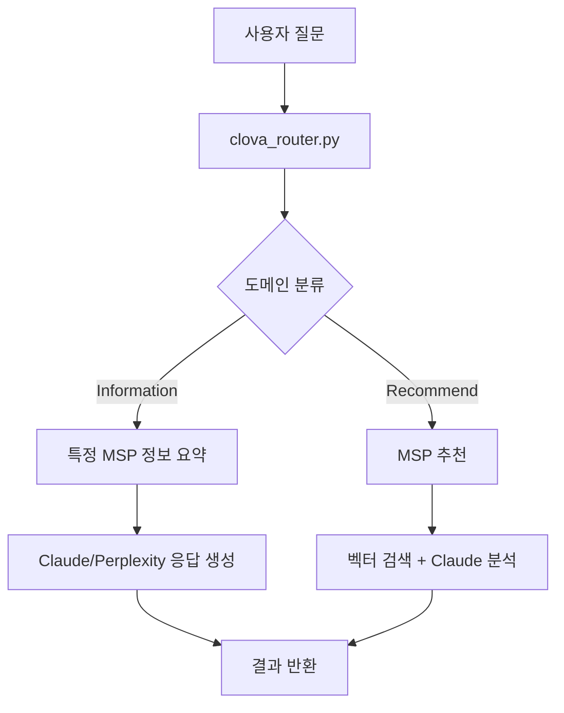

# MSP 평가 도구 - 종합 개발자 가이드

## 목차
1. [프로젝트 아키텍처 개요](#프로젝트-아키텍처-개요)
2. [핵심 파일 구조 및 역할](#핵심-파일-구조-및-역할)
3. [API 엔드포인트 완전 가이드](#api-엔드포인트-완전-가이드)
4. [데이터 플로우 및 처리 과정](#데이터-플로우-및-처리-과정)
5. [외부 API 서비스 상세 가이드](#외부-api-서비스-상세-가이드)
6. [배포 환경 및 인프라](#배포-환경-및-인프라)
7. [주요 기능 수정 가이드](#주요-기능-수정-가이드)
8. [로그 모니터링 및 디버깅](#로그-모니터링-및-디버깅)
9. [성능 최적화 및 확장성](#성능-최적화-및-확장성)
10. [추가 핵심 개발자 지식](#추가-핵심-개발자-지식)

---

## 프로젝트 아키텍처 개요

### 전체 시스템 구조
```
┌─────────────────┐    ┌──────────────────┐    ┌─────────────────┐
│   Frontend      │    │     Backend      │    │   Vector DB     │
│  (React/HTML)   │◄──►│    (FastAPI)     │◄──►│   (ChromaDB)    │
└─────────────────┘    └──────────────────┘    └─────────────────┘
         ▲                        ▲                       ▲
         │                        │                       │
┌─────────────────┐    ┌──────────────────┐    ┌─────────────────┐
│ Admin Dashboard │    │   External APIs  │    │  File Storage   │
│  (Auth Portal)  │    │ (HyperCLOVA/     │    │   (uploads)     │
│                 │    │  Claude/Pplx)    │    │                 │
└─────────────────┘    └──────────────────┘    └─────────────────┘
```

### 기술 스택 상세
- **Frontend**: React (CDN), Tailwind CSS, Chart.js
- **Backend**: FastAPI, Python 3.8+
- **Vector Database**: ChromaDB (로컬 PersistentClient)
- **AI Services**: HyperCLOVA, Claude-3, Perplexity
- **Authentication**: FastAPI-Login (쿠키 기반)
- **Web Server**: Nginx (리버스 프록시)
- **SSL**: Let's Encrypt (자동 갱신)

---

## 핵심 파일 구조 및 역할

### 백엔드 핵심 파일

#### `api_server.py` - 메인 FastAPI 서버
```python
# 주요 역할
- FastAPI 앱 초기화 및 라우팅
- ChromaDB 클라이언트 설정
- 정적 파일 서빙
- CORS 설정
- 관리자 인증 통합

# 핵심 섹션
app = FastAPI()  # 메인 앱 인스턴스
collection = client.get_or_create_collection("msp_chunks")  # Vector DB 컬렉션
app.include_router(admin_router)  # 관리자 라우터 포함
```

#### `msp_core.py` - AI 검색 엔진 핵심
```python
# 주요 함수들
run_msp_recommendation()      # 기본 MSP 추천 (Claude 기반)
run_msp_information_summary_claude()   # Claude 기반 정보 요약
run_msp_information_summary_pplx()     # Perplexity 기반 고급 검색
extract_msp_name()           # 질문에서 회사명 추출
```

#### `evaluator.py` - AI 평가 엔진
```python
# 핵심 기능
evaluate_answer(question, answer) → int  # 1-5점 AI 평가
- HyperCLOVA fine-tuned 모델 사용
- 평가 기준(Rubric) 기반 채점
- 병렬 처리 지원
```

#### `vector_writer.py` - 벡터 DB 관리
```python
# 주요 함수
clova_embedding(text) → List[float]  # CLOVA 임베딩 생성
add_msp_data_to_chroma()             # 벡터 DB에 데이터 저장
chunk_text()                         # 텍스트 청킹
```

#### `admin_protected.py` - 인증 시스템
```python
# 보안 기능
@manager.user_loader         # 사용자 로더
login/logout 엔드포인트      # 인증 처리
delete_company()             # 관리자 전용 삭제
check_auth()                 # 인증 상태 확인
```

### 프론트엔드 구조

#### 메인 페이지들
- `main.html` - 랜딩 페이지 (React 기반)
- `search.html` - 검색 도구 (React 기반)
- `upload.html` - Excel 업로드 도구
- `admin.html` - 관리자 대시보드
- `vector-db-viewer.html` - DB 뷰어 (React 기반)

#### React 컴포넌트 패턴
```javascript
// 상태 관리 패턴
const [data, setData] = useState([]);
const [loading, setLoading] = useState(true);

// API 호출 패턴  
useEffect(() => {
    fetchData()
        .then(setData)
        .catch(handleError)
        .finally(() => setLoading(false));
}, []);
```

---

## API 엔드포인트 완전 가이드

### 검색 관련 엔드포인트

#### `POST /query/router`
```json
Request: {
    "query": "보안이 강점인 MSP 추천해줘",
    "chat_history": [],
    "advanced": false
}

Response: {
    "answer": "AI 생성 답변",
    "evidence": [질문/답변/점수 배열],
    "advanced": false,
    "model_used": "claude-3-haiku"
}
```

#### `POST /query/advanced_naver`
NAVER 검색 API 기반 고급 검색

### 평가 관련 엔드포인트

#### `POST /api/upload_excel`
```python
# 처리 과정
1. Excel 파일 파싱 (3개 시트: 인적역량, AI기술역량, 솔루션역량)
2. 각 답변에 대해 HyperCLOVA AI 평가 (1-5점)
3. 카테고리별 점수 계산
4. 그룹별 요약 생성

# Response 구조
{
    "evaluated_questions": [...],
    "summary": [...],
    "groups": [...],
    "group_to_category": {...}
}
```

#### `POST /api/add_to_vector_db`
평가 완료된 데이터를 ChromaDB에 저장

### 관리 관련 엔드포인트

#### `GET /api/leaderboard`
```python
# 실시간 순위 계산 로직
1. ChromaDB에서 모든 MSP 데이터 조회
2. calculate_msp_category_scores() 함수로 점수 계산
3. 카테고리별 점수 (인적역량, AI기술역량, 솔루션역량)
4. 총점 기준 정렬 후 반환
```

#### `DELETE /ui/delete_company/{company_name}`
관리자 전용 MSP 데이터 삭제

### 인증 관련 엔드포인트

#### `POST /auth/login`
```python
# 인증 흐름
1. 환경변수에서 admin 계정 정보 확인
2. FastAPI-Login으로 JWT 토큰 생성
3. HttpOnly 쿠키로 토큰 저장
4. 관리자 페이지로 리다이렉트
```

---

## 데이터 플로우 및 처리 과정

### Excel 업로드 → AI 평가 → 벡터 저장



#### 핵심 처리 단계
1. **파일 파싱**: `parse_excel_category_sheets()` - 3개 시트 처리
2. **AI 평가**: `evaluate_answer()` - HyperCLOVA로 1-5점 채점
3. **점수 집계**: `compute_category_scores_from_excel_data()` - 카테고리별 평균
4. **벡터화**: `clova_embedding()` - 1024차원 임베딩 생성
5. **저장**: ChromaDB에 메타데이터와 함께 저장

### 자연어 검색 플로우



---

## 외부 API 서비스 상세 가이드

### AI 서비스별 역할 및 사용법

#### 1. HyperCLOVA (NAVER Cloud Platform)
```python
# 사용 목적: 평가, 임베딩, 도메인 분류
# API 키: CLOVA_API_KEY, CLOVA_API_KEY_OPENAI

# A. 자동 평가 (evaluator.py)
- 모델: fine-tuned model (ft:tuning-1883-250519-111923-2qjqh)
- 엔드포인트: /testapp/v2/tasks/bjlkpn9s/chat-completions
- 기능: Excel 답변을 1-5점으로 AI 평가

# B. 임베딩 생성 (vector_writer.py)  
- 엔드포인트: /serviceapp/v1/api-tools/embedding/v2
- 출력: 1024차원 벡터
- 용도: 벡터 검색을 위한 텍스트 임베딩

# C. 도메인 분류 (clova_router.py)
- 엔드포인트: /serviceapp/v1/routers/haxvawqc/versions/1/route
- 기능: 질문을 Information/Recommend/Unrelated로 분류

# D. 기본 검색 응답 (msp_core.py)
- 모델: HCX-005 (OpenAI 호환 엔드포인트)
- 용도: 기본 MSP 추천 및 정보 요약
```

#### 2. Claude (Anthropic)
```python
# 사용 목적: 고급 분석 및 추천
# API 키: ANTHROPIC_API_KEY

# A. 고급 MSP 추천 (msp_core.py - run_msp_recommendation)
- 모델: claude-3-haiku-20240307
- 기능: 복합적 요구사항 분석 및 정교한 MSP 추천
- 특징: 증거 기반 추천, 리스크 평가, 대안 제시

# B. 정보 요약 (msp_core.py - run_msp_information_summary_claude)
- 기능: 특정 MSP에 대한 상세 분석
- 특징: 내부 데이터 + 웹 정보 종합 분석

# C. 뉴스 기반 분석 (msp_core.py - run_msp_news_summary_claude)
- 기능: NAVER 검색 결과와 내부 데이터 결합 분석
- 특징: 최신 뉴스 + 평가 데이터 통합
```

#### 3. Perplexity
```python
# 사용 목적: 웹 기반 실시간 정보 검색
# API 키: PPLX_API_KEY

# A. 고급 웹 검색 (msp_core.py - run_msp_information_summary_pplx)
- 모델: sonar
- 기능: 실시간 웹 정보 + 내부 데이터 통합 분석
- 특징: 최신 동향, 경쟁사 비교, 시장 분석
```

#### 4. NAVER Search API
```python
# 사용 목적: 뉴스 및 웹 문서 검색
# API 키: NAVER_CLIENT_ID, NAVER_CLIENT_SECRET

# A. 뉴스 검색 (msp_core.py - run_msp_news_summary_claude/clova)
- 엔드포인트: /v1/search/news.json
- 기능: 특정 MSP 관련 최신 뉴스 수집

# B. 웹 문서 검색
- 엔드포인트: /v1/search/webkr.json  
- 기능: 한국어 웹 문서 검색
```

### 검색 플로우 및 라우팅 시스템

#### 도메인 분류 시스템 (clova_router.py)
```python
# 사용자 질문 → CLOVA Router → 도메인 분류
{
    "domain": {
        "result": "mspevaluator"  # 또는 기타 도메인
    },
    "blockedContent": {
        "result": ["Information"] # 또는 ["Recommend"] 또는 ["Unrelated"]
    }
}

# 분류 결과에 따른 처리 (api_server.py)
if domain_result == "mspevaluator":
    if "Information" in blocked:
        # 특정 MSP 정보 요약
        if data.advanced:
            return run_msp_information_summary_pplx(data.query)  # Perplexity
        else:
            return run_msp_information_summary_claude(data.query)  # Claude
    elif "Recommend" in blocked:
        # MSP 추천
        return run_msp_recommendation(data.query, min_score=0)  # Claude
    elif "Unrelated" in blocked:
        # 관련 없는 질문
        return {"answer": "MSP 관련 질문이 아닙니다"}
```

#### 검색 타입별 처리 방식

**1. 기본 검색 (POST /query/router)**
```python
# 흐름: 사용자 질문 → CLOVA 도메인 분류 → 타입별 처리
# Information: Claude 기반 MSP 정보 요약
# Recommend: Claude 기반 MSP 추천 (벡터 검색 + AI 분석)
```

**2. 고급 검색 (advanced=true)**
```python  
# Information 타입일 때 Perplexity 사용
# 웹 기반 실시간 정보 + 내부 평가 데이터 결합
```

**3. NAVER 검색 (POST /query/advanced_naver)**
```python
# NAVER Search API + Claude 분석
# 뉴스 기사 + 웹 문서 + 내부 데이터 통합
```

---

## 배포 환경 및 인프라

### NAVER Cloud Platform 환경

#### 서버 스펙
- **OS**: Ubuntu 20.04 LTS
- **RAM**: 8GB (ChromaDB 운영용)
- **Storage**: 500GB+
- **vCPU**: 2코어 이상

#### 디렉토리 구조
```bash
/home/ubuntu/msp-evaluator/
├── api_server.py              # FastAPI 메인 서버
├── chroma_store/              # ChromaDB 데이터 (중요!)
├── static/                    # 프론트엔드 파일
├── templates/                 # Jinja2 템플릿
├── .env                       # 환경변수 (보안 중요)
├── venv/                      # Python 가상환경
└── requirements.txt
```

#### Systemd 서비스 설정
```ini
# /etc/systemd/system/msp-evaluator.service
[Unit]
Description=MSP Evaluator FastAPI
After=network.target

[Service]
User=ubuntu
WorkingDirectory=/home/ubuntu/msp-evaluator
Environment=PATH=/home/ubuntu/msp-evaluator/venv/bin
ExecStart=/home/ubuntu/msp-evaluator/venv/bin/uvicorn api_server:app --host 127.0.0.1 --port 8000 --workers 4
Restart=on-failure

[Install]
WantedBy=multi-user.target
```

#### Nginx 설정
```nginx
# /etc/nginx/sites-available/msp-evaluator
server {
    listen 80;
    server_name mspevaluator.duckdns.org;

    location / {
        proxy_pass http://127.0.0.1:8000;
        proxy_set_header Host $host;
        proxy_set_header X-Real-IP $remote_addr;
        proxy_read_timeout 300;
    }
}
```

---

## 주요 기능 수정 가이드

### AI 평가 로직 수정

**파일**: `evaluator.py`
```python
# 평가 점수 기준 변경하려면
def evaluate_answer(question: str, answer: str) -> int:
    # 1. system_prompt 수정 (37행 근처)
    system_prompt = "새로운 평가 기준..."
    
    # 2. 점수 범위 변경하려면 (1-5 → 1-10)
    # - user_prompt에서 범위 수정
    # - 정규식 패턴 수정: r"\b([1-5])\b" → r"\b([1-9]|10)\b"
```

### 검색 알고리즘 개선

**파일**: `msp_core.py`
```python
# run_msp_recommendation() 함수 수정
def run_msp_recommendation(question: str, min_score: int):
    # 1. 검색 결과 수 조정 (22행)
    n_results=20  # 더 많은 결과를 원하면 증가
    
    # 2. Claude 모델 변경 (167행)
    model="claude-3-haiku-20240307"  # → "claude-3-sonnet-20241022"
    
    # 3. 온도 조정 (168행)
    temperature=0.1  # 더 창의적: 0.3, 더 일관적: 0.05
```

### 벡터 DB 설정 변경

**파일**: `vector_writer.py`
```python
# 임베딩 차원 변경 시
collection = client.get_or_create_collection(
    name="msp_chunks",
    metadata={"hnsw:space": "cosine"},  # 유사도 메트릭 변경
)

# 청킹 전략 수정 (chunk_text 함수)
"postProcessMaxSize": 1000,  # 청크 최대 크기
"postProcessMinSize": 300,   # 청크 최소 크기
```

### 프론트엔드 UI 수정

**React 컴포넌트 수정**:
```javascript
// search.html에서 검색 옵션 추가
const searchOptions = [
    { label: "기본 검색", value: "standard" },
    { label: "고급 검색", value: "advanced" },
    { label: "새 검색 타입", value: "new_type" }  // 추가
];

// API 호출 수정
const handleSearch = async (searchType) => {
    const endpoint = searchType === 'new_type' 
        ? '/api/new_search_endpoint' 
        : '/query/router';
    // ...
};
```

### 관리자 기능 확장

**파일**: `admin_protected.py`
```python
# 새로운 관리자 전용 API 추가
@router.post("/admin/bulk_update")
def bulk_update_scores(user=Depends(manager)):
    # 대량 점수 업데이트 로직
    pass

@router.get("/admin/analytics")  
def get_analytics(user=Depends(manager)):
    # 분석 데이터 반환
    pass
```

---

## 로그 모니터링 및 디버깅

### 주요 로그 위치

#### 시스템 로그
```bash
# FastAPI 서비스 로그
sudo journalctl -u msp-evaluator -f

# 최근 에러만 확인
sudo journalctl -u msp-evaluator --since "1 hour ago" | grep -i error

# Nginx 로그
sudo tail -f /var/log/nginx/access.log
sudo tail -f /var/log/nginx/error.log
```

#### 일반적인 에러 패턴

```python
# 1. ChromaDB 연결 오류
[ERROR] Cannot connect to ChromaDB: Permission denied
# 해결: sudo chown -R ubuntu:ubuntu chroma_store/

# 2. API 키 오류  
[ERROR] Failed to generate embedding: API rate limit exceeded
# 해결: .env 파일에서 API 키 확인

# 3. 메모리 부족
[ERROR] Process killed: Out of memory
# 해결: 스왑 메모리 추가 또는 인스턴스 업그레이드
```

### 디버깅 도구

#### 벡터 DB 상태 확인
```python
# Python 콘솔에서 실행
from chromadb import PersistentClient
client = PersistentClient(path="chroma_store")
collection = client.get_collection("msp_chunks")

# 기본 통계
print(f"총 벡터 수: {collection.count()}")

# 특정 MSP 데이터 확인
results = collection.get(where={"msp_name": "베스핀글로벌"})
print(f"베스핀글로벌 데이터 수: {len(results['ids'])}")
```

#### API 응답 시간 측정
```bash
# 검색 API 성능 테스트
curl -w "시간: %{time_total}초\n" \
  -X POST http://localhost:8000/query/router \
  -H "Content-Type: application/json" \
  -d '{"query":"보안 전문 MSP", "advanced":false}'
```

### 성능 모니터링

#### 시스템 리소스 확인
```bash
# 실시간 시스템 상태
htop

# 디스크 사용량
df -h

# 메모리 사용량  
free -h

# 프로세스별 메모리 사용량
ps aux | grep python | head -10
```

---

## 성능 최적화 및 확장성

### 병목 지점 및 해결방안

#### 1. AI API 호출 최적화
```python
# evaluator.py에서 배치 처리 구현
import asyncio
import aiohttp

async def evaluate_batch(questions_answers):
    """여러 답변을 동시에 평가"""
    tasks = []
    for q, a in questions_answers:
        tasks.append(evaluate_answer_async(q, a))
    return await asyncio.gather(*tasks)
```

#### 2. 벡터 검색 성능 향상
```python
# msp_core.py에서 캐싱 추가
from functools import lru_cache

@lru_cache(maxsize=100)
def cached_embedding(text: str):
    return clova_embedding(text)

# 검색 결과 수 제한
collection.query(
    query_embeddings=[vector],
    n_results=15,  # 너무 크지 않게 설정
    where={"score": {"$gte": min_score}}
)
```

#### 3. 메모리 관리
```python
# 대용량 데이터 처리 시 제너레이터 사용
def process_large_dataset(data):
    for chunk in chunked(data, 100):  # 100개씩 처리
        yield process_chunk(chunk)
```

### 확장성 고려사항

#### 분산 처리 준비
```python
# 향후 Redis 캐싱 도입을 위한 인터페이스
class CacheManager:
    def get(self, key): pass
    def set(self, key, value, ttl=3600): pass
    
# 현재는 메모리 캐시, 향후 Redis로 교체 가능
cache = MemoryCache()  # 또는 RedisCache()
```

#### 데이터베이스 샤딩 준비
```python
# vector_writer.py에서 컬렉션 분할 준비
def get_collection_name(msp_name):
    # MSP별 또는 카테고리별 컬렉션 분할
    hash_value = hash(msp_name) % 4
    return f"msp_chunks_{hash_value}"
```

### 배포 자동화

#### GitHub Actions 워크플로우 예시
```yaml
name: Deploy to Production
on:
  push:
    branches: [main]
    
jobs:
  deploy:
    runs-on: ubuntu-latest
    steps:
      - uses: actions/checkout@v3
      - name: Deploy to server
        run: |
          ssh user@server "
            cd /home/ubuntu/msp-evaluator &&
            git pull &&
            source venv/bin/activate &&
            pip install -r requirements.txt &&
            sudo systemctl restart msp-evaluator
          "
```

---

## 문제 해결 체크리스트

### 서비스 중단 시
1. **즉시 확인**: `sudo systemctl status msp-evaluator`
2. **로그 확인**: `sudo journalctl -u msp-evaluator --lines=50`
3. **포트 확인**: `sudo netstat -tlnp | grep :8000`
4. **재시작**: `sudo systemctl restart msp-evaluator`

### 성능 저하 시
1. **메모리 확인**: `free -h`
2. **디스크 확인**: `df -h`
3. **ChromaDB 권한**: `ls -la chroma_store/`
4. **API 키 상태**: 각 외부 서비스 콘솔에서 확인

### 데이터 이상 시
1. **벡터 DB 백업**: `tar -czf backup.tar.gz chroma_store/`
2. **데이터 무결성**: `/ui/data` 엔드포인트로 확인
3. **개별 MSP 확인**: `/api/debug_msp/{msp_name}`

---

## 추가 핵심 개발자 지식

### 보안 취약점 및 개선 필요사항

#### 현재 알려진 보안 이슈
```python
# 1. 관리자 비밀번호 평문 저장 (.env 파일)
ADMIN_PASSWORD=supersecret  # ❌ 평문 저장
# 개선방안: bcrypt 해싱 적용 필요

# 2. API 키 로그 노출 위험
# 로그에서 API 키가 노출될 수 있음 - 로그 필터링 필요

# 3. 파일 업로드 검증 부족
# evaluator.py에서 Excel 파일 악성 코드 검증 추가 필요
```

#### 보안 강화 방안
```python
# admin_protected.py 개선안
import bcrypt

def hash_password(password):
    return bcrypt.hashpw(password.encode('utf-8'), bcrypt.gensalt())

def verify_password(password, hashed):
    return bcrypt.checkpw(password.encode('utf-8'), hashed)
```

### 데이터 일관성 및 백업 전략

#### ChromaDB 데이터 무결성
```python
# 데이터 검증 스크립트 (주기적 실행 권장)
def validate_vector_data():
    results = collection.get(include=["metadatas", "embeddings"])
    
    issues = []
    for i, (meta, embedding) in enumerate(zip(results["metadatas"], results["embeddings"])):
        # 1. 필수 필드 확인
        if not meta.get("msp_name") or not meta.get("question"):
            issues.append(f"Missing fields in entry {i}")
        
        # 2. 임베딩 차원 확인
        if len(embedding) != 1024:
            issues.append(f"Invalid embedding dimension in entry {i}")
        
        # 3. 점수 범위 확인
        score = meta.get("score")
        if score and (score < 1 or score > 5):
            issues.append(f"Invalid score {score} in entry {i}")
    
    return issues
```

#### 자동 백업 스크립트
```bash
#!/bin/bash
# backup_automation.sh
DATE=$(date +%Y%m%d_%H%M%S)
BACKUP_DIR="/backup/msp-evaluator"

# 1. ChromaDB 백업
tar -czf "$BACKUP_DIR/chromadb_$DATE.tar.gz" chroma_store/

# 2. 환경설정 백업
cp .env "$BACKUP_DIR/env_$DATE.backup"

# 3. 코드 백업 (Git commit hash 포함)
git rev-parse HEAD > "$BACKUP_DIR/commit_$DATE.txt"

# 4. 7일 이상 된 백업 삭제
find "$BACKUP_DIR" -name "*.tar.gz" -mtime +7 -delete
```

### API 사용량 및 비용 모니터링

#### API 호출 추적
```python
# utils.py에 추가
import time
from collections import defaultdict

class APIUsageTracker:
    def __init__(self):
        self.usage = defaultdict(list)
    
    def track_call(self, api_name, cost=0):
        self.usage[api_name].append({
            'timestamp': time.time(),
            'cost': cost
        })
    
    def get_daily_usage(self, api_name):
        today = time.time() - 86400  # 24시간 전
        return len([call for call in self.usage[api_name] 
                   if call['timestamp'] > today])

# 사용 예시
tracker = APIUsageTracker()

# evaluator.py에서
def evaluate_answer(question, answer):
    tracker.track_call('hyperclova', 0.001)  # 비용 추적
    # ... 기존 코드
```

#### 비용 알림 시스템
```python
# cost_monitor.py
def check_monthly_costs():
    costs = {
        'hyperclova': tracker.get_monthly_cost('hyperclova'),
        'claude': tracker.get_monthly_cost('claude'),
        'perplexity': tracker.get_monthly_cost('perplexity')
    }
    
    if sum(costs.values()) > 100:  # $100 초과 시
        send_alert(f"월간 API 비용 초과: ${sum(costs.values())}")
```

### 업데이트 및 마이그레이션 전략

#### 데이터베이스 스키마 변경
```python
# migration_scripts/add_category_field.py
def migrate_add_category():
    """카테고리 필드가 없는 기존 데이터에 카테고리 추가"""
    results = collection.get(include=["metadatas"])
    
    updates = []
    for i, meta in enumerate(results["metadatas"]):
        if not meta.get("category"):
            # 질문 내용으로 카테고리 추론
            category = infer_category_from_question(meta["question"])
            meta["category"] = category
            updates.append({"id": results["ids"][i], "metadata": meta})
    
    # 배치 업데이트
    for batch in chunked(updates, 100):
        collection.update(
            ids=[item["id"] for item in batch],
            metadatas=[item["metadata"] for item in batch]
        )
```

#### 점진적 배포 전략
```python
# feature_flags.py
FEATURE_FLAGS = {
    "new_search_algorithm": os.getenv("ENABLE_NEW_SEARCH", "false").lower() == "true",
    "enhanced_ui": os.getenv("ENABLE_ENHANCED_UI", "false").lower() == "true",
}

# 사용 예시
if FEATURE_FLAGS["new_search_algorithm"]:
    result = new_search_function(query)
else:
    result = legacy_search_function(query)
```

### 외부 서비스 장애 대응

#### API 장애 시 폴백 전략
```python
# api_resilience.py
import asyncio
from functools import wraps

def with_fallback(fallback_func):
    def decorator(func):
        @wraps(func)
        async def wrapper(*args, **kwargs):
            try:
                return await func(*args, **kwargs)
            except Exception as e:
                logger.warning(f"{func.__name__} failed: {e}")
                return fallback_func(*args, **kwargs)
        return wrapper
    return decorator

@with_fallback(lambda q: "검색 서비스 일시 장애")
async def enhanced_search(query):
    # Perplexity API 호출
    pass
```

#### 서비스 상태 확인
```python
# health_check.py
async def check_external_services():
    services = {
        'hyperclova': check_hyperclova_status(),
        'claude': check_claude_status(),
        'chromadb': check_chromadb_status()
    }
    
    failed_services = [name for name, status in services.items() if not status]
    
    if failed_services:
        logger.error(f"Services down: {failed_services}")
        # 알림 발송 또는 자동 복구 시도
```

### 성능 최적화 심화

#### 메모리 프로파일링
```python
# performance_profiler.py
import psutil
import tracemalloc

class MemoryProfiler:
    def __init__(self):
        tracemalloc.start()
        self.start_memory = psutil.Process().memory_info().rss
    
    def checkpoint(self, label):
        current_memory = psutil.Process().memory_info().rss
        memory_diff = current_memory - self.start_memory
        print(f"[{label}] Memory usage: {memory_diff / 1024 / 1024:.1f} MB")
        
        snapshot = tracemalloc.take_snapshot()
        top_stats = snapshot.statistics('lineno')[:5]
        for stat in top_stats:
            print(f"  {stat}")
```

#### 병렬 처리 최적화
```python
# parallel_processing.py
import concurrent.futures
import asyncio

async def process_evaluations_parallel(question_answer_pairs):
    """평가 작업을 병렬로 처리"""
    loop = asyncio.get_event_loop()
    
    with concurrent.futures.ThreadPoolExecutor(max_workers=5) as executor:
        tasks = [
            loop.run_in_executor(executor, evaluate_answer, q, a)
            for q, a in question_answer_pairs
        ]
        return await asyncio.gather(*tasks)
```

### 코드 품질 및 테스트

#### 단위 테스트 예시
```python
# tests/test_evaluator.py
import pytest
from unittest.mock import patch
from evaluator import evaluate_answer

class TestEvaluator:
    @patch('evaluator.requests.post')
    def test_evaluate_answer_success(self, mock_post):
        mock_post.return_value.json.return_value = {
            "result": {"message": {"content": "4"}}
        }
        
        score = evaluate_answer("AI 인력은?", "30명의 AI 전문가 보유")
        assert score == 4
    
    def test_evaluate_answer_invalid_response(self, mock_post):
        mock_post.return_value.json.return_value = {
            "result": {"message": {"content": "invalid"}}
        }
        
        result = evaluate_answer("질문", "답변")
        assert isinstance(result, str)  # 에러 메시지 반환
```

#### 코드 리뷰 체크리스트
```markdown
## 코드 리뷰 체크리스트

### 보안
- [ ] API 키가 하드코딩되지 않았는가?
- [ ] 사용자 입력이 적절히 검증되는가?
- [ ] SQL/NoSQL 인젝션 가능성은 없는가?

### 성능
- [ ] 불필요한 API 호출이 없는가?
- [ ] 메모리 누수 가능성은 없는가?
- [ ] 대용량 데이터 처리 시 스트리밍을 사용하는가?

### 가독성
- [ ] 함수명이 명확한가?
- [ ] 복잡한 로직에 주석이 있는가?
- [ ] 매직 넘버가 상수로 정의되었는가?
```

### 운영 도구 및 스크립트

#### 시스템 상태 대시보드
```python
# system_dashboard.py
import psutil
import json
from datetime import datetime

def get_system_status():
    return {
        'timestamp': datetime.now().isoformat(),
        'cpu_percent': psutil.cpu_percent(),
        'memory_percent': psutil.virtual_memory().percent,
        'disk_percent': psutil.disk_usage('/').percent,
        'chromadb_size': get_directory_size('chroma_store/'),
        'active_connections': len(psutil.net_connections()),
        'uptime_seconds': time.time() - psutil.boot_time()
    }

# 웹 엔드포인트로 노출
@app.get("/admin/system-status")
def system_status(user=Depends(manager)):
    return get_system_status()
```

#### 데이터 정리 스크립트
```python
# cleanup_scripts.py
def remove_duplicate_entries():
    """중복 항목 제거"""
    results = collection.get(include=["metadatas"])
    
    seen = set()
    duplicates = []
    
    for i, meta in enumerate(results["metadatas"]):
        key = f"{meta['msp_name']}_{meta['question']}"
        if key in seen:
            duplicates.append(results["ids"][i])
        seen.add(key)
    
    if duplicates:
        collection.delete(ids=duplicates)
        print(f"Removed {len(duplicates)} duplicate entries")
```

---

---

## 마무리

이 가이드는 MSP 평가 도구의 핵심 구조와 수정 방법을 다룹니다. 추가 질문이나 특정 기능 구현이 필요한 경우:

**개발자 연락처**: 
- 신예준 (Yejoon Shin)
- 이메일: mistervic03@gmail.com / yejoons_2026@gatech.edu
- GitHub: [IronhawkReigns](https://github.com/IronhawkReigns)

**유용한 참고 자료**:
- [FastAPI 공식 문서](https://fastapi.tiangolo.com/)
- [ChromaDB 문서](https://docs.trychroma.com/)
- [HyperCLOVA X API](https://www.ncloud.com/product/aiService/clovaStudio)
- [Anthropic Claude API](https://docs.anthropic.com/)
- [Perplexity API](https://docs.perplexity.ai/)

**중요한 추가 고려사항**:
- 정기적인 보안 업데이트 및 패치 적용
- API 사용량 모니터링 및 비용 최적화
- 데이터 백업 및 복구 절차 정기 테스트
- 성능 모니터링 및 최적화 지속
- 사용자 피드백 수집 및 개선사항 반영

이 시스템은 지속적인 개선과 유지보수를 통해 더욱 강력하고 안정적인 MSP 평가 플랫폼으로 발전할 수 있습니다.

*최종 업데이트: 2025년 6월*